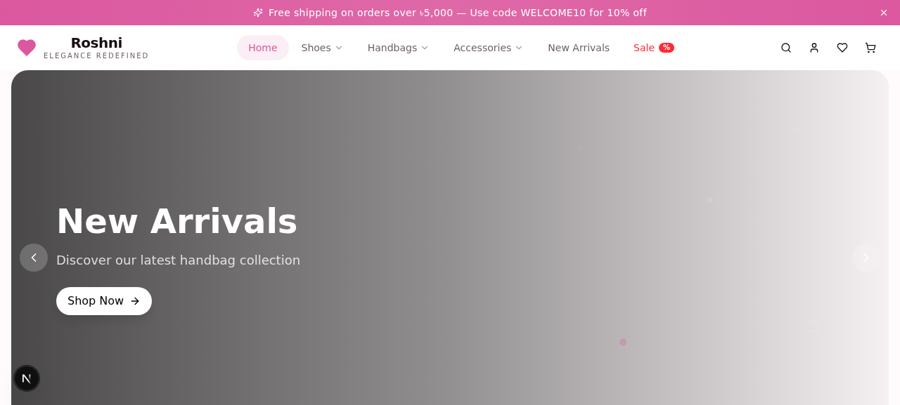
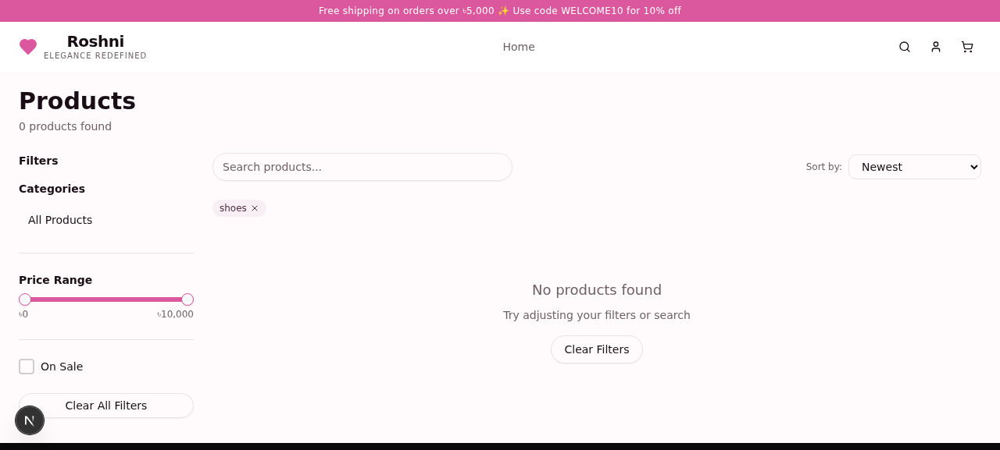
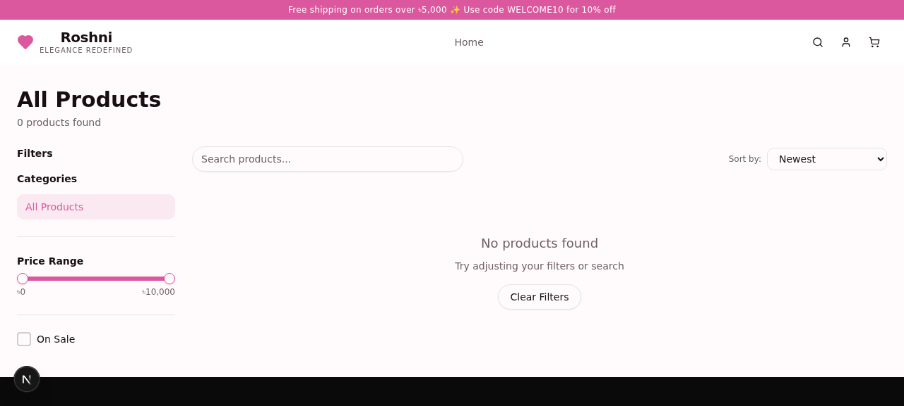
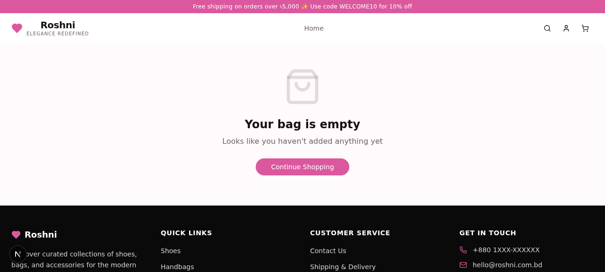
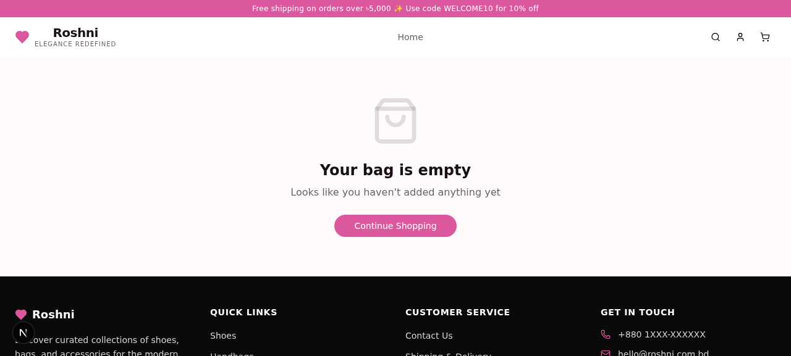
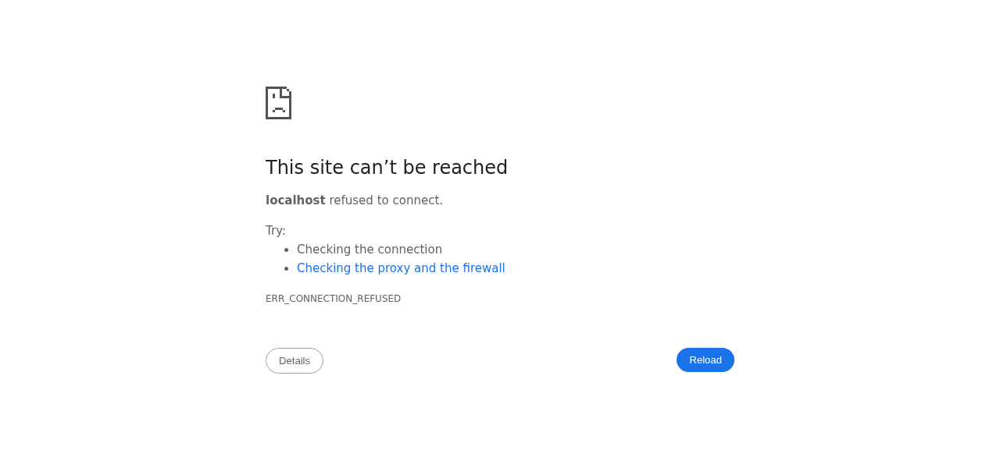

# Roshni — Women's Fashion E-Commerce Platform

A premium e-commerce platform specializing in women's shoes, bags, and accessories for the Bangladesh market. Built with Next.js 16, TypeScript, Prisma, and a modern UI stack.



## ✨ Features

### Customer Features
- 🛍️ **Product Catalog** — Browse curated collections with advanced filtering
- 🔍 **Smart Search** — Find products by name, category, or tags
- 💝 **Wishlist** — Save favorite items
- 🛒 **Shopping Cart** — Persistent cart with guest & user support
- 📦 **Order Tracking** — View order history and status
- 🎁 **Promo Codes** — Apply discount codes at checkout
- 🚚 **Free Shipping** — On orders over ৳5,000
- 🌙 **Dark Mode** — System preference with manual toggle
- 📱 **Mobile Responsive** — Optimized for all devices

### Admin Features
- 📊 **Dashboard** — Sales analytics and key metrics
- 📦 **Product Management** — CRUD operations with variants
- 🏷️ **Category Management** — Hierarchical categories
- 🎨 **Banner Management** — Homepage hero banners
- 📋 **Order Management** — Process and track orders
- ⚙️ **Settings** — Site configuration

## 🛠️ Tech Stack

### Frontend
- **Framework:** Next.js 16 (App Router)
- **Language:** TypeScript
- **Styling:** Tailwind CSS 4
- **UI Components:** shadcn/ui (30+ Radix components)
- **State Management:** Zustand
- **Animations:** Framer Motion
- **Icons:** Lucide React
- **Forms:** React Hook Form + Zod validation

### Backend
- **Runtime:** Node.js (via Next.js API Routes)
- **Database:** SQLite (via Prisma ORM)
- **Authentication:** bcryptjs
- **Data Fetching:** TanStack Query (React Query)

## 📁 Project Structure

```
roshni/
├── prisma/
│   └── schema.prisma           # Database schema
├── public/                     # Static assets
├── src/
│   ├── app/
│   │   ├── api/               # Backend API routes
│   │   │   ├── auth/          # Authentication
│   │   │   ├── products/      # Product endpoints
│   │   │   ├── cart/          # Cart operations
│   │   │   ├── orders/        # Order management
│   │   │   └── admin/         # Admin endpoints
│   │   ├── globals.css        # Global styles
│   │   ├── layout.tsx         # Root layout
│   │   └── page.tsx           # Main SPA router
│   ├── components/
│   │   ├── admin/             # Admin dashboard
│   │   ├── store/             # Customer-facing pages
│   │   └── ui/                # shadcn/ui components
│   ├── hooks/                 # Custom React hooks
│   └── lib/
│       ├── db.ts              # Prisma client
│       ├── store.ts           # Zustand store
│       └── utils.ts           # Utility functions
├── .env                       # Environment variables (not committed)
├── package.json
└── tsconfig.json
```

## 🚀 Getting Started

### Prerequisites
- Node.js 18+ or Bun
- Git

### Installation

1. **Clone the repository**
```bash
git clone https://github.com/YOUR_USERNAME/roshni.git
cd roshni
```

2. **Install dependencies**
```bash
npm install
# or
bun install
```

3. **Set up environment variables**
```bash
# Create .env file
cp .env.example .env

# Edit .env and add:
DATABASE_URL="file:./db/custom.db"
```

4. **Initialize database**
```bash
npm run db:push
# or
bun run db:push
```

5. **Run development server**
```bash
npm run dev
# or
bun run dev
```

6. **Open browser**
```
http://localhost:3000
```

## 📦 Database Schema

### Core Models
- **User** — Customer & admin accounts
- **Category** — Product categorization (hierarchical)
- **Product** — Main catalog with variants
- **ProductVariant** — Size/color options
- **CartItem** — Shopping cart (guest + user)
- **Order** — Order records with status tracking
- **Payment** — Payment transactions
- **Banner** — Homepage hero banners
- **PromoCode** — Discount codes
- **StoreSetting** — Site configuration

## 🎨 Design Features

### Animations
- Page transitions with Framer Motion
- Spring physics for natural movement
- Smooth cart drawer slide-in
- Progress indicators on scroll
- Hover effects on product cards

### UX Enhancements
- Free shipping progress bar
- Recently viewed products tracking
- Wishlist with heart animations
- Toast notifications
- Loading states with skeletons
- Back-to-top button with progress ring

## 📜 Available Scripts

```bash
# Development
npm run dev              # Start dev server on port 3000
npm run build            # Build for production
npm run start            # Start production server
npm run lint             # Run ESLint

# Database
npm run db:push          # Push schema to database
npm run db:generate      # Generate Prisma client
npm run db:migrate       # Run migrations
npm run db:reset         # Reset database
```

## 🌐 Deployment

### Frontend (Vercel)
1. Connect GitHub repository to Vercel
2. Set environment variables
3. Deploy automatically on push to main

### Backend (Railway)
1. Connect GitHub repository to Railway
2. Set environment variables
3. Deploy automatically on push to main

### Environment Variables
```env
DATABASE_URL="your_database_url"
```

## 🔒 Security Notes

- Passwords hashed with bcryptjs
- SQL injection protected via Prisma
- Environment variables for sensitive data
- HTTPS enforced in production

## 📝 License

This project is private and proprietary.

## 👨‍💻 Author

**Neloy** — Full Stack MERN Developer (AI-Driven Development)
- Email: seyasbro@gmail.com

## 🤝 Contributing

This is a client project. Contributions are not accepted at this time.

## 📸 Screenshots

### Homepage


### Product Catalog


### Product Detail


### Shopping Cart


### Checkout


### Admin Dashboard


---

**Built with ❤️ for modern women who value elegance and convenience**
