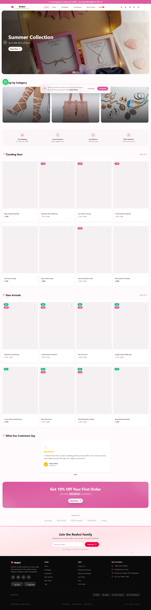
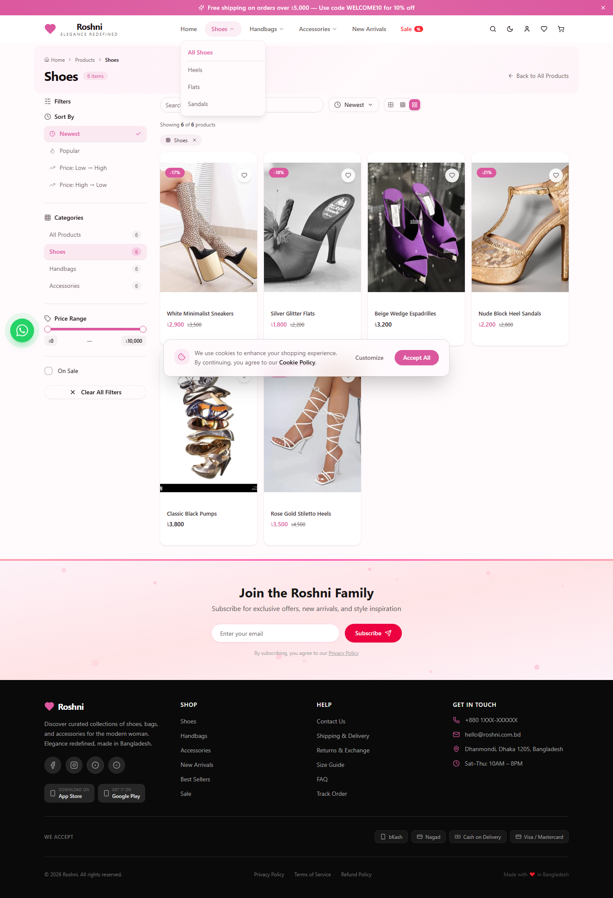
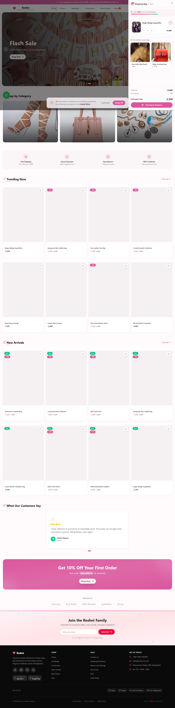
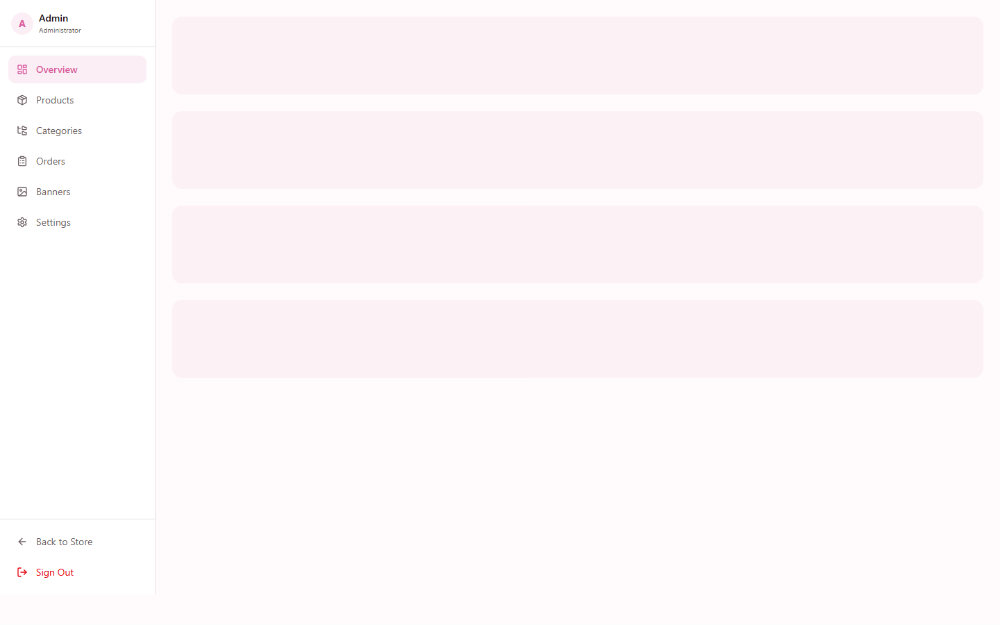
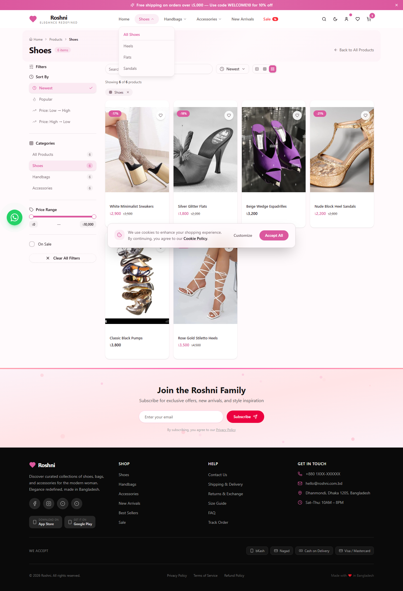

# Roshni — Women's Fashion E-Commerce Platform

A premium e-commerce platform for the Bangladesh market specializing in women's shoes, handbags, and accessories. Built with Next.js 16, PostgreSQL, and a modern UI stack.

**Live:** [roshni-ecommerce.vercel.app](https://roshni-ecommerce.vercel.app)

---

## Features

### Customer
- **Product Catalog** — Browse 18 products across 3 categories (Shoes, Handbags, Accessories) with 9 subcategories
- **Smart Search** — Debounced live search with dropdown results
- **Filters** — Category, price range, sale items; sort by popularity, price, newest
- **Product Detail** — Image zoom, size/color variants, size guide, tabs, share, related products
- **Cart** — Slide-over drawer + full page with promo codes, free shipping progress bar
- **Checkout** — 3-step flow (Address → Payment → Review) with bKash/Nagad selection
- **Wishlist** — Save favorites, quick view modal, recently viewed tracking
- **Orders** — Order history with status badges, delivery estimates
- **Auth** — Login/Register with email or phone
- **Account** — Profile editing, address management
- **Dark Mode** — System preference detection with manual toggle, persists across sessions
- **Accessibility** — Responsive design, keyboard navigation, screen reader support
- **Localization** — next-intl configured for Bengali (RTL) support

### Admin Dashboard
- Overview stats with sales charts (recharts)
- Product CRUD with variant management
- Hierarchical category CRUD
- Order management with status tracking
- Banner management with drag-to-reorder
- Store settings configuration

---

## Screenshots

| | | |
|---|---|---|
|  |  |  |
| Home Page | Product Listing (Shoes) | Shopping Cart |
|  |  | |
| Admin Dashboard | Product Detail Page | |

---

## Tech Stack

| Layer | Technology |
|-------|-----------|
| Framework | [Next.js 16](https://nextjs.org/) (App Router) |
| Language | TypeScript |
| Styling | [Tailwind CSS 4](https://tailwindcss.com/) + [shadcn/ui](https://ui.shadcn.com/) (40+ Radix primitives) |
| State | [Zustand](https://zustand-demo.pmnd.rs/) (persisted) + [TanStack Query](https://tanstack.com/query) |
| Database | PostgreSQL 16 via [Prisma 6](https://www.prisma.io/) ORM |
| Auth | bcryptjs (password hashing) |
| Animations | [Framer Motion 12](https://www.framer.com/motion/) |
| Images | [Cloudinary](https://cloudinary.com/) (auto format + quality) |
| Forms | React Hook Form + Zod |
| Icons | [Lucide React](https://lucide.dev/) |
| Charts | [Recharts](https://recharts.org/) |
| Hosting | [Vercel](https://vercel.com/) (Next.js) + [Railway](https://railway.com/) (PostgreSQL) |

---

## Project Structure

```
src/
├── app/
│   ├── api/              # 16 API routes (products, cart, orders, auth, admin...)
│   ├── globals.css       # Global styles, animations, dark theme
│   ├── layout.tsx        # Root layout
│   └── page.tsx          # SPA shell with client-side routing
├── components/
│   ├── admin/            # Admin dashboard
│   ├── store/            # Customer-facing pages (12 components)
│   └── ui/               # shadcn/ui component library
├── hooks/                # use-toast, use-mobile
└── lib/
    ├── db.ts             # Prisma client
    ├── store.ts          # Zustand store (auth, cart, UI, wishlist, dark mode)
    └── utils.ts          # Utility functions
prisma/
└── schema.prisma         # Database schema (10 models)
seed.ts                   # Seed data (18 products, 2 users, banners, promo codes)
```

---

## Getting Started

### Prerequisites
- Node.js 20+
- npm

### Installation

```bash
git clone https://github.com/neloy559/roshni-ecommerce.git
cd roshni-ecommerce

npm install
cp .env.example .env
# Edit .env with your DATABASE_URL (PostgreSQL)

npx prisma generate
npx prisma db push
npx tsx seed.ts

npm run dev
```

Open [http://localhost:3000](http://localhost:3000).

### Demo Credentials

| Role | Email | Password |
|------|-------|----------|
| Admin | `admin@roshni.com` | `admin123` |
| Customer | `nusrat@example.com` | `customer123` |

---

## Database Schema

10 models — User, Category, Product, ProductVariant, CartItem, Order, Payment, Banner, PromoCode, StoreSetting.

See [prisma/schema.prisma](prisma/schema.prisma) for full schema.

---

## Scripts

```bash
npm run dev          # Development server (port 3000)
npm run build        # Production build
npm run lint         # ESLint
npm run db:push      # Push schema to database
npm run db:generate  # Generate Prisma client
npm run db:migrate   # Run migrations
npm run db:reset     # Reset database
```

---

## Deployment

### Vercel (Frontend + API)
Auto-deploys on push to `main`. Environment variables configured in Vercel Dashboard.

### Railway (PostgreSQL)
TCP Proxy enabled for external connections. DATABASE_URL set in Vercel env vars.

---

## Author

**F.S. Neloy** — [seyasbro@gmail.com](mailto:seyasbro@gmail.com)

---

*Private & proprietary — built for Roshni brand.*
